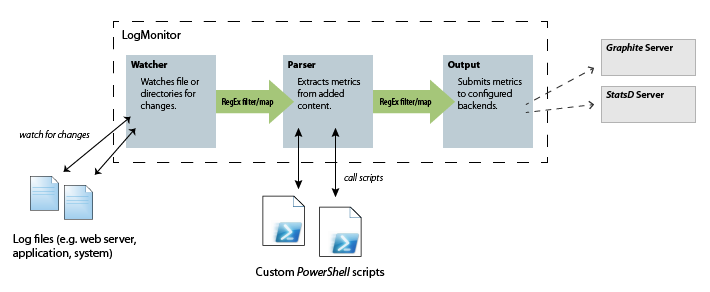

# LogMonitor

*LogMonitor* is a combination of *logtail* and [*logster*](https://github.com/etsy/logster), but specifically designed for windows systems. It watches directories or files for changes, extracts metrics from the added content and submits these metrics to a configured backend (*graphite*, *statsd* or *console*).

Extracting metrics from added content is done by *PowerShell* scripts, which can be created or customized at will.

## Documentation

*LogMonitor* consists of three components:

 1. Watching files or directories for changes.
 2. Parsing added content.
 3. Submitting metrics to backends.

Every component can be configured seperately and plugged together at will. Therefore you could e.g. watch two directories for changes, process all changes through the same parsers, but submit changes of the directories to seperat backends. *Mapping* between the components is always performed by regular expressions on the file names of the read changes.

## Running *LogMonitor*

*LogMonitor* can run in a console window (simply start `LogMonitor.exe`) or as a windows service.

To install *LogMonitor* as a Windows Service execute the following command:

    C:\Windows\Microsoft.NET\Framework\v4.0.30319\installutil.exe LogMonitor.exe

And start the *LogMonitor* service with the command

    net start LogMonitor

## Configuration

Configuration is done completely through the `App.config` (i.e. `LogMonitor.config`) file. An example is available at [source/LogMonitor/App.config](https://github.com/peschuster/LogMonitor/blob/master/source/LogMonitor/App.config)

Add the configuration section to your `app.config` file:

    <configSections>
      <section name="logMonitor" type="LogMonitor.Configuration.LogMonitorConfiguration, LogMonitor"/>
    </configSections>

### Watched directories

    <watch>
      <add path="C:\inetpub\logs\LogFiles\W3SVC1" type="w3c" filter="*.log" maxDaysInactive="2" />
    </watch>

**Options:**

 * `path` - Path to a directory or file.
 * `filter` - *[optional]*, default: "*". Filter for watched files in directory.
 * `type` - *[optional]*, if `w3c` all lines are split in respective fields. Powershell scripts are provided with an `W3CChange` object.
 * `maxDaysInactive` - *[optional]*, default: -1. If set, only files with activity during the last `x` days (configured value) are watched for changes.
 * `bufferTime` - *[optional]*, default: 500. Time (in ms) for which events by the file system are buffered (i.e. aggregated) before processing.
 * `intervalTime` - *[optional]*, default: 5000. Interval (in ms) of manual checks for changed files (in case file system raised no events).

### Parser for metrics

    <parser>
      <add scriptPath=".\Scripts\CallCountProcessor.ps1" pattern="\.log$" />
      <add scriptPath=".\Scripts\TimeTakenProcessor.ps1" pattern="\.log$" />
      <add scriptPath=".\Scripts\HttpStatusProcessor.ps1" pattern="\.log$" />
    </parser>

**Options:**

 * `scriptPath` - Path to *PowerShell* script.
 * `pattern` - RegEx pattern applied to log file names, to map parsers to specific files, file types or locations.

### Output backends

    <output>
      <add pathPattern="w3SVC7" type="." target="statsd" metricsPrefix="mysite1" />
      <add pathPattern="w3SVC6" type="." target="statsd" metricsPrefix="mysite2" />
      <add pathPattern="w3SVC5" type="." target="statsd" metricsPrefix="mysite3" />
    </output>

**Options:**

 * `pathPattern` - RegEx pattern applied to log file names, to map output backends to specific files, file types or locations.
 * `type` - RegEx pattern to filter metrics by type.
 * `target` - Name of the backend (`graphite`, `statsd` or `console`).
 * `metricsPrefix` - Prefix applied to all metrics, before sending them to the backend.

### Additional configuration

The *graphite* and *statsd* backends need extra configuration:

    <configSections>
      <section name="graphite" type="Graphite.Configuration.GraphiteConfiguration, Graphite" />
    </configSections>
    <graphite xmlns="http://github.com/peschuster/Graphite/Configuration">
      <graphite address="127.0.0.1" port="2003" transport="Tcp" />
      <statsd address="127.0.0.1" port="8125" prefixKey="test" />
    </graphite>

*LogMonitor* uses the graphite base library for these backends: [Graphite](https://github.com/peschuster/graphite-client)

To see/store log messages you can simply add a *trace listener* in your configuration:

    <system.diagnostics>
      <trace autoflush="true" indentsize="4">
        <listeners>
          <add name="configConsoleListener" type="System.Diagnostics.ConsoleTraceListener" />
        </listeners>
      </trace>
    </system.diagnostics>

## Writing *PowerShell* script parsers

A *PowerShell* script for extracting metrics from added lines must always contain a function with the following signature:

    Function MetricProcessor ([LogMonitor.FileChange] $change)
    {
    }

It also must always return a list of `LogMonitor.Metric` objects. Objects of this type can be created by calling `[LogMonitor.Metric]::Create(..)`.

Here is an example for simply returning the number of added lines:

    $metrics = @()
        
    if ($change.GetType().FullName -eq "LogMonitor.Processors.W3CChange")
    {
		$metrics += [LogMonitor.Metric]::Create('calls', $change.Values.Count, [LogMonitor.MetricType]::Counter)
    }
        
    return $metrics

This example also checks for the type `LogMonitor.Processors.W3CChange` which is passed to the *PowerShell* script for log files of type `w3c`.

## Planned features

- Command line interface for reading historical data.

## Build

How to build *LogMonitor*:
 
1. Go to `\build\` directory
2. Execute `go.bat`